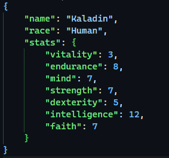

# character-display
Making a RESTful API just to learn how to use the net/http Go package.

 
# Features
    - User Registration, Login and Authentication.
    - Adding JSON RPG characters that look like this
        
    to a database.
    - Editing said characters and filtering them by username, character name, class or race.

 
# Next
Making the frontend that handles this API.